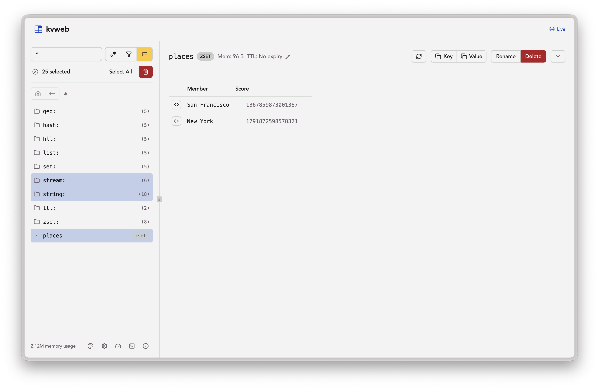
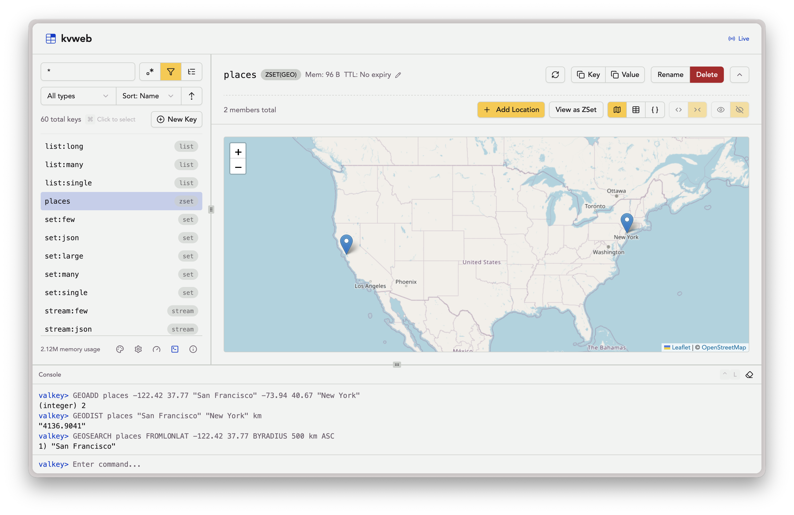
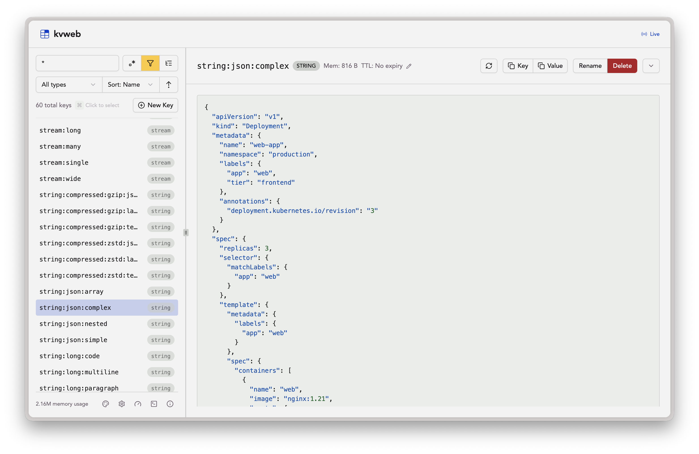
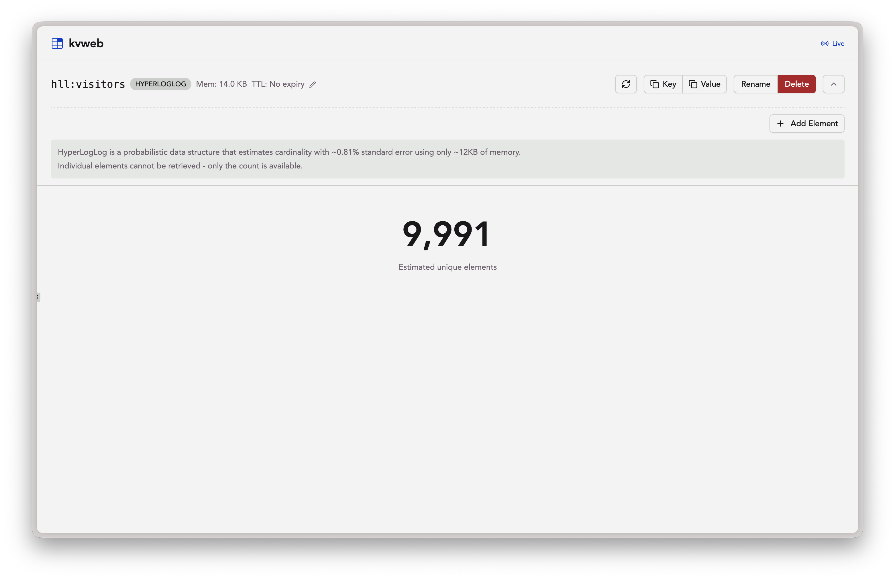

# kvweb

A web-based GUI for browsing and editing Valkey/Redis databases. Inspired by [pgweb](https://github.com/sosedoff/pgweb).

Go backend with embedded Svelte frontend in a single binary.









## Features

- **Browse and edit** string, hash, list, set, sorted set, stream, HyperLogLog, and geo keys
- **Search** with glob patterns or regex, filter by type, sort by name/type/TTL/memory
- **Tree view** for navigating keys by prefix hierarchy, or flat list view
- **Inline editing** with per-type editors — rename fields, adjust scores, update coordinates
- **Live updates** — key changes show up as they happen, via keyspace notifications
- **Command console** for running ad-hoc Valkey commands
- **Compressed values** — gzip and zstd auto-detected, decompressed for display, re-compressed on save
- **Geo map view** — plot sorted set members on an interactive OpenStreetMap
- **JSON syntax highlighting** with compact/formatted toggle
- **Dark mode** with system preference detection and manual toggle
- **Read-only mode** — disable all writes via `--readonly`
- **Prefix isolation** — restrict visible keys with `--prefix`
- **Bulk operations** — multi-select keys for batch delete
- **Keyboard shortcuts** — delete, select all, range select, clear console
- **Copy to clipboard** — copy key names or full values in one click
- **TTL management** — set, edit, and watch live countdowns

## Install

Download the latest binary from [GitHub Releases](https://github.com/natrimmer/kvweb/releases/latest), extract it, and add it to your PATH.

With Docker:

```
docker run --rm -p 8080:8080 ghcr.io/natrimmer/kvweb -url host.docker.internal:6379
```

With Nix:

```
nix profile install github:natrimmer/kvweb
```

Or build from source (requires Go, Node.js, pnpm):

```
git clone https://github.com/natrimmer/kvweb
cd kvweb
cd web && pnpm install && pnpm build && cd ..
rm -rf static/dist && cp -r web/dist static/
go build -o kvweb ./cmd/kvweb
```

The frontend has to be built into `static/dist/` first, because the binary embeds
it from there. Inside the devenv shell, `build` does all of the above and stamps
the version from `git describe`.

## Usage

```
kvweb [flags]
```

| Flag | Default | Description |
|------|---------|-------------|
| `-url` | `localhost:6379` | Server address or URL (see below) |
| `-password` | | Server password (prefer `VALKEY_PASSWORD` env var) |
| `-db` | `0` | Database number |
| `-host` | `localhost` | HTTP listen address |
| `-port` | `8080` | HTTP listen port |
| `-readonly` | `false` | Disable write operations |
| `-prefix` | | Only show keys matching this prefix |
| `-disable-flush` | `true` | Block FLUSHDB and FLUSHALL even in write mode |
| `-max-keys` | `0` | Limit SCAN count per request (0 = no limit) |
| `-notifications` | `false` | Auto-enable keyspace notifications for live updates |
| `-cors-origin` | | Allowed CORS origin (e.g. `http://localhost:5173`). Omit to disallow cross-origin requests |
| `-open` | `false` | Open browser on start |
| `-dev` | `false` | Skip serving embedded frontend (API + WebSocket only) |

### Connection URLs

The `-url` flag accepts a plain `host:port` or a full URL with scheme:

```
kvweb -url localhost:6379
kvweb -url redis://:password@localhost:6379/2
kvweb -url rediss://host:6380
```

Supported schemes: `redis://`, `rediss://` (TLS), `valkey://`, `valkeys://` (TLS), `unix://`.

The URL can include username, password, and database number. The `-password` and `-db` flags override values from the URL when set.

The `rediss://` and `valkeys://` schemes enable TLS with system CA certificates. Custom CA certs, client certificates, and other advanced TLS settings are not supported through the URL.

## Testing

The test suite runs against a real Redis and a real Valkey server, launched by
the tests themselves. There are no mocks.

```
tests               # everything CI runs
test-integration    # integration tests only, verbose, both engines
test-unit           # -short: skips anything that needs a server
```

Outside the devenv shell, `go test ./...` works as long as `valkey-server` and
`redis-server` are on your PATH; it skips cleanly if they are not. See
[`internal/testenv/README.md`](internal/testenv/README.md) for how the harness
works and how to add a test.

## Versioning

kvweb uses [SemVer](https://semver.org/) with git tags as the source of truth. The version and commit hash are embedded at build time via `git describe`.

```
git tag -a v0.2.0 -m "v0.2.0"
git push origin v0.2.0
```

```
kvweb --version
kvweb v0.2.0 (a1b2c3d)
```
